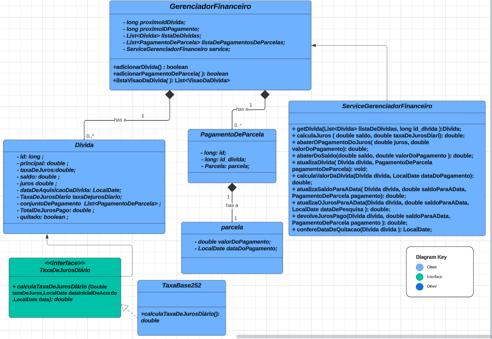

# Desafio MAPS

## Candidato: Andreas Hukuhara Christe

### Descrição:
A aplicação tem como propósito ajudar pessoas a gerirem suas dívidas, ajudando no planejamento para
limpar o seu nome;

### Estruturação do projeto:

O diagrama acima Resume o planejamento utilizado para realizar as 3 principais funções da api. O Gerenciador financeiro é composto por uma lista de dívidas, uma lista de Pagamentos e pela instância ServiceGerenciadorFinanceiro que auxiliam nas operações necessárias para o processo de inclusão de dívidas, adicionar pagamento de parcelas e pela consulta de dividas;

