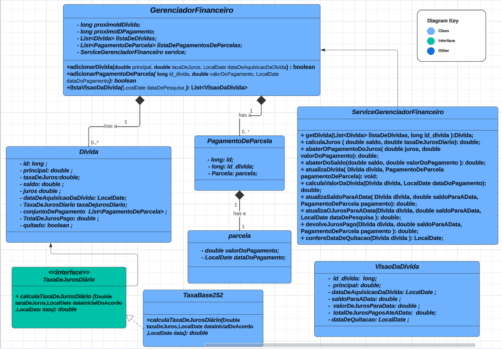

# Desafio MAPS

## Candidato: Andreas Hukuhara Christe

### Descrição:
A aplicação tem como propósito ajudar pessoas a gerirem suas dívidas, ajudando no planejamento para limpar o seu nome.

O projeto foi feito com maven para o gerenciamento de dependências e os testes unitários foram utilizando o junit 5;

### Estruturação do projeto:

O diagrama acima Resume o planejamento utilizado para realizar as 3 principais funções da api. O Gerenciador financeiro é composto por uma lista de dívidas, uma lista de Pagamentos e pela instância ServiceGerenciadorFinanceiro que auxiliam nas operações necessárias para o processo de inclusão de dívidas, adicionar pagamento de parcelas e pela consulta de dividas.

Breve descrição das apis:

- Função adicionarDivida(double principal, double taxaDeJuros, LocalDate dataDeAquisicaoDaDivida)  retorna um  boolean. Essa função verifica se as do valor principal apresentada no desafio e adiciona uma instância de dívida à lista de dívidas, retornando true caso a operação dê certo;

- Função adicionarPagamentoDeParcela(long id_divida, double valorDoPagamento, LocalDate dataDoPagamento) retorna um boolean. Ela é responsável por verificar todas as restrições descrita no desafio  e adiciona uma instância de Pagamento de Parcela à lista de pagamento de parcela. os cálculos necessários para essa operação estão presente no serviceGerenciadorFinanceiro;

- Função List< VisaoDaDivida > listaVisaoDaDivida(LocalDate dataDePesquisa)  retorna uma lista de Visão das dívidas de acordo com a data de pesquisa. Essa função percorre as dívidas e seus respectivos pagamentos para efetuar os cálculos necessários e adicionar uma instância de visão da dívida  à lista.

